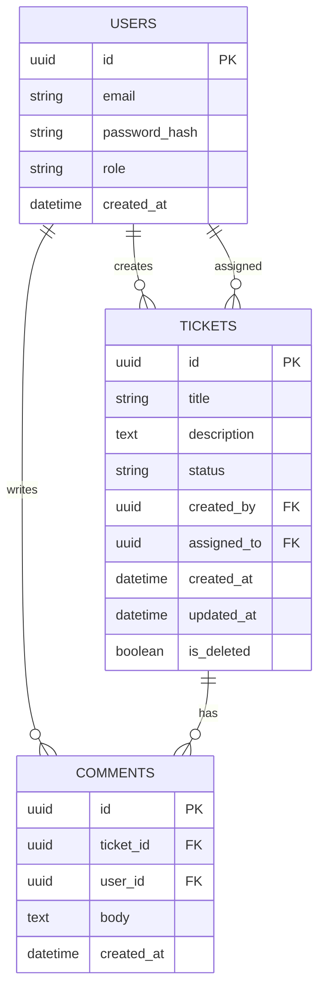

```mermaid
erDiagram
    USERS ||--o{ TICKETS : creates
    USERS ||--o{ TICKETS : assigned
    USERS ||--o{ COMMENTS : writes
    TICKETS ||--o{ COMMENTS : has

    USERS {
        uuid id PK
        string email
        string password_hash
        string role
        datetime created_at
    }

    TICKETS {
        uuid id PK
        string title
        text description
        string status
        uuid created_by FK
        uuid assigned_to FK
        datetime created_at
        datetime updated_at
        boolean is_deleted
    }

    COMMENTS {
        uuid id PK
        uuid ticket_id FK
        uuid user_id FK
        text body
        datetime created_at
    }
```

---
